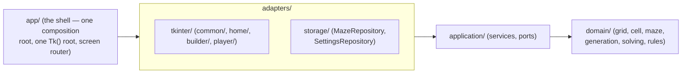

# Architecture Spine — Labyrinthes

## Design Paradigm

**Hexagonal / Ports & Adapters.** The maze engine (grid, 0/1/2/3 cell encoding, generation, solving, Level/Difficulty rules) is the core and depends on nothing external. Tkinter and on-disk storage are adapters plugged into the core through explicit ports. Chosen over a plain layered split because the legacy `big_boss` pattern shows a convention-only boundary erodes over time — this makes the boundary structural instead.



Layers map to directories:

```text
src/labyrinthes/
  domain/          # pure engine: grid, cell, maze, generation, solving, game rules
                    # (levels/difficulty/timer) — immutable, zero I/O, zero UI import
  application/      # orchestration services (e.g. BuilderService, PlayerService)
                    # + port definitions (MazeRepository, SettingsRepository)
  adapters/
    tkinter/
      common/        # shared widgets: buttons, tooltips, theme toggle, settings
                      # panel, confirmation dialogs — used by home/, builder/, player/
      home/            # Home screen: navigation hub (Builder/Player entry points,
                        # Settings access)
      builder/         # Builder screen (maze canvas, wall-editing cursor, zones)
      player/          # Player screen (maze canvas, ball, HUD)
    storage/         # CSV-based implementations of the persistence ports
  app/               # one composition root (the shell) — owns the single Tk()
                      # root and the screen router that Home, Builder, and
                      # Player are registered with
```

## Invariants & Rules

### AD-1 — Domain/UI decoupling is structural, not conventional

- **Binds:** all
- **Prevents:** a UI framework (Tkinter today, a web framework tomorrow) leaking into engine logic; recreating the legacy `big_boss`/"Entité supérieure" pattern the PRD names as an explicit anti-goal; an adapter quietly bypassing `application/` to reach another adapter directly.
- **Rule:** `domain/` and `application/` import nothing from `adapters/` or any UI framework. Dependency direction is one-way: `app/` → `adapters/` → `application/` → `domain/`; `domain/` depends on nothing else in this project. Within `adapters/`, `adapters/tkinter/` depends only on `application/` — never directly on `adapters/storage/` (storage access always goes through an `application/` service, so validation/business rules centralized there — e.g. FR-4's bounds check — can't be bypassed).

### AD-2 — Domain state is immutable

- **Binds:** `domain/` (Grid, Cell, Maze, generation, solving, game rules)
- **Prevents:** the present adapter (Tkinter) and the future one (web) inventing divergent in-place-mutation contracts against the engine; a mutable method silently creeping back in.
- **Rule:** `Grid`/`Cell`/`Maze` and other domain value objects are immutable (implemented as frozen dataclasses or equivalent — no method mutates `self`). Engine operations (break a wall, generate, solve) are pure functions that take a state and return a new state. Each adapter owns the mutable "current state" reference and re-renders after every call — the same usage pattern present and future adapters will share. `[ADOPTED — Max's choice]`

### AD-3 — Domain object shapes are pinned, not left implicit

- **Binds:** `domain/`, `application/`, AD-5 (single `MazeRepository`)
- **Prevents:** two independent implementers (e.g. whoever writes maze generation vs. whoever writes Game movement/rendering) inventing incompatible in-memory shapes for the same concept — the same kind of drift the addendum flags between the legacy's two different Level 2/Level 4 reveal-threshold formulas (FR-13 exists to fix that; an unpinned domain type would let it resurface here instead).
- **Rule:**
  - `Grid` is indexed `[row][col]`, 0-origin, top-left origin, with a fixed width/height.
  - `Cell` is a thin immutable wrapper around its `"0"`–`"3"` digit (AD-6's public contract), exposing decoded wall booleans as computed properties — never decoded into a separate representation that could drift from the stored digit.
  - `Position` is a single shared `(row, col)` type, used for entry, exit, and ball/cursor location alike.
  - `Maze` = `Grid` + entry `Position` + exit `Position` + a kind tag (`classic` | `sketch` | `saved-random` | `generated`, per FR-5/FR-9/FR-11) + `id: MazeId | None` (`[Amended]`). `generated` is a freshly-generated random maze not yet written to disk (FR-10, before FR-11's separate save action) — distinct from `saved-random`, which is only reached by transition, never assigned at generation time. Saving a `generated` maze produces a new `Maze` value carrying `saved-random` instead (per AD-2 — a new value, not an in-place tag mutation). This distinction exists because AD-10's `Edit in Builder` gating needs to tell "has a Builder-editable file on disk" (`classic`, `saved-random`) apart from "does not" (`sketch`, `generated`). `MazeId` is a single shared opaque-identifier type (mirroring `Position`), present only for `classic`/`saved-random` mazes (`None` for `sketch`/`generated`, mirroring the kind split above) — minted, once, by a single shared minting function (used identically by `MazeRepository`'s save path and AD-8's migration script — neither independently implements its own scheme), at the moment a `Maze` first transitions into `classic` or `saved-random` (AD-6). Every subsequent re-save of an already-`classic`/`saved-random` `Maze` (e.g. an Edit-in-Builder session saving over itself) carries the existing `id` forward unchanged rather than re-minting — `MazeRepository.save()` never mints an `id` for a `Maze` that already has one — so identity survives edits, independent of filename. This is what AD-12's `RecordsRepository` keys records on, and the "always non-`None` once `classic`/`saved-random`" guarantee is exactly what AD-12's `record_completion` relies on without a separate null check. `[Amended — added to support FR-27's Personal Records, Max's choice]`
  - `Level` is a single fixed type covering `1`–`4` plus a `MAX` sentinel with a defined ordinal ordering (`MAX` above `4`), so FR-13's "unlockable from Level 2 onward" gating is a plain comparison. `Difficulty` is `1`–`3`.
  - `Duration` is a single shared immutable type (e.g. a whole count of milliseconds) used identically by FR-16's Timer and FR-27's `Record.time` — one shared type, not independently invented per feature. `[Amended — added to support FR-27's Personal Records]`

### AD-4 — Only persistence is a port; rendering is not `[Amended]`

- **Binds:** `adapters/tkinter/`, a future web adapter, `application/`
- **Prevents:** forcing Tkinter and a future web UI to share an over-constrained rendering abstraction that fits neither well.
- **Rule:** each UI adapter implements its own rendering directly, calling `application/` services (commands/queries). Only persistence is a port: `MazeRepository`, `SettingsRepository`, and `RecordsRepository` (AD-12) are the sole ports defined in `application/`, each implemented under `adapters/storage/` — a future persisted concept adds to this list rather than inventing a differently-shaped abstraction. `[Amended — RecordsRepository added]`

### AD-5 — One shared maze read/write implementation

- **Binds:** FR-20, `adapters/storage/`
- **Prevents:** Builder and Game diverging on how they read/write the maze CSV format.
- **Rule:** exactly one `MazeRepository` implementation lives under `adapters/storage/` and is used by every screen that needs it (Home, Builder, Player) through the shell's single composition root — no per-screen duplicate parsing.

### AD-6 — Cell encoding and maze format are a preserved public contract, additively extended for record-keying `[Amended]`

- **Binds:** `domain/`, `adapters/storage/`, FR-20, FR-27
- **Prevents:** losing the 0/1/2/3 data contract during the rewrite; a record-keying identifier being invented ad hoc outside the file (a path-based key, a side-mapping file) that could silently drift from the maze it names.
- **Rule:** cell encoding stays `"0"`/`"1"`/`"2"`/`"3"` strings (bit 1 = top wall, bit 2 = left wall). The maze save format keeps the legacy shape (entry/exit header lines + grid rows), renamed per FR-23 but never re-encoded — with one additive exception: a new `MazeId` header line (AD-3), inserted immediately after the existing entry/exit header lines and before the first grid row (a fixed position, not merely "alongside" them), present only when the maze is saved as `classic` or `saved-random`. This is an additive, backward-compatible format extension — existing fields keep their exact meaning and position, nothing already on disk is re-encoded — approved explicitly by Max as the one case where AD-6's format is allowed to grow rather than only rename (FR-23 stays about naming; this is the sole content addition). `sketch` and `generated` mazes carry no `MazeId` line, consistent with AD-3. Every writer of this format — `MazeRepository`'s save path and AD-8's migration script alike — serializes the `MazeId` line through the same shared routine, so the two can't drift into different positions or delimiters. `[Amended — Max approved this specific, additive exception to unblock FR-27's Personal Records]`

### AD-7 — Settings persistence is scoped, granular, and single-implementation per scope

- **Binds:** FR-4, FR-21, `SettingsRepository`
- **Prevents:** the legacy clobbering bug (each app loading the whole shared settings file into memory and dumping it whole on close) — and the same category of bug reappearing at the `shared`-scope boundary if two independently-built stories each implement their own backing store for it.
- **Rule:** `SettingsRepository` exposes only `get(scope, key)` / `set(scope, key, value)`, written immediately — never a load-everything/mutate-in-memory/dump-everything cycle. Three scopes: `builder` (private), `game` (private), `shared` (global). Exactly one `SettingsRepository` implementation lives under `adapters/storage/` and is used by every screen that needs it — no per-screen duplicate implementation, mirroring AD-5's rule for `MazeRepository`. A setting is `shared` only if both Builder and Player must observe the identical value within the same session (e.g. the FR-4/FR-10 size bounds) — everything else defaults to private. The set of `shared`-scope key names is declared once, in one module the shell imports, so scope classification is settled by code layout rather than by independent per-key judgment calls. `[Max's choice, refined after Max flagged that a naive per-app file split alone would break FR-4's single-source-of-truth requirement]`

### AD-8 — Legacy data migration is a one-time script, not a permanent shim `[Amended]`

- **Binds:** FR-23, FR-27
- **Prevents:** `adapters/storage/` permanently carrying two on-disk formats; the migration script and the repositories independently inventing mismatched new folder/file names; legacy mazes staying permanently ineligible for Personal Records because they predate `MazeId`.
- **Rule:** the legacy layout (French folder names, `entité,nom,valeur` headers) is converted by a standalone one-time script, then retired — no permanent dual-format read path in `adapters/storage/`. The new layout's path/naming scheme is declared once (e.g. as constants in `adapters/storage/`) and imported by both the migration script and the repositories, rather than each independently choosing names that happen to need to match. The same one-time script also mints and writes AD-6's `MazeId` header line for every legacy **classic and saved-random** maze it converts (both kinds predate that concept, per AD-3's id-eligibility rule — not classics alone), reusing `MazeRepository`'s own writer for that line (AD-6) rather than a bespoke migration-script serializer, so migrated mazes are Personal-Records-eligible from day one, with the same `MazeId` shape and position a freshly-saved maze would get. `[Max's choice — resolves PRD Open Question 4; MazeId backfill added to unblock FR-27]`

### AD-9 — Domain/UI boundary is enforced by an automated test

- **Binds:** `domain/`, `application/`, `adapters/tkinter/`
- **Prevents:** the boundary eroding silently over time, the way it did in the legacy `big_boss` pattern; AD-1's, AD-10's, and AD-11's "never import each other directly"/one-way-dependency rules going unchecked.
- **Rule:** a pytest test scans `domain/` and `application/` source for forbidden imports (`tkinter`, `adapters`), and additionally flags `adapters/tkinter/` importing `adapters/storage/` directly, any of `adapters/tkinter/home`, `adapters/tkinter/builder`, `adapters/tkinter/player` importing one another, and `adapters/tkinter/common/` importing any of `home/`, `builder/`, `player/` (AD-11's dependency only runs one way) — closing the enforcement gap for AD-1's lateral-import rule, AD-10's screen-navigation rule, and AD-11's shared-toolkit direction with the same mechanism. Runs alongside the existing ruff + pytest quality gate (NFR §6). `[Max's choice]`

### AD-10 — Single shell, Home-routed screen navigation `[Amended]`

- **Binds:** FR-8, FR-19, `app/`, `adapters/tkinter/home`, `adapters/tkinter/builder`, `adapters/tkinter/player`
- **Prevents:** recreating the legacy `Lab_builder`/`Parcoureur_labs` cross-reference tangle; Home, Builder, and Player each inventing their own navigation mechanism now that the finalized UX (`ux-Labyrinthes-2026-08-04`) fixes Home as *"the sole general router"* between them, inside *"one navigation shell."*
- **Rule:** there is exactly **one composition root** under `app/` — the shell. It owns the single `Tk()` root and a screen router; Home, Builder, and Player are the three screens registered with that router (each keyed by a stable enum member, not a bare string), not independently launchable apps (this supersedes the original AD-10, which assumed two separate composition roots that launched each other — the finalized UX's Information Architecture settles this more specifically than the PRD alone could). The router only tracks these three top-level screens; a screen may own further-nested navigation of its own — e.g. Player's maze-selection → gameplay flow (both are "Player" to the router) — and is responsible for feeding a dynamic label for its current sub-state (e.g. `"Classic Maze 4"`) to the shared breadcrumb widget (AD-11's `common/`), rather than the router modeling that depth itself.
  Each screen implements a common interface, `mount(parent, state: Maze | None) -> Frame` (state typed per AD-3; `None` when a screen is entered with no carried context, e.g. via Home), so the router can swap them uniformly. Screen-to-screen navigation hands live in-memory domain state directly through this parameter, no serialization hop. Three distinct Builder↔Player transitions exist, and only two of them carry state:
  - **Test in Player** (FR-8, contextual, always available from a Builder session): passes the in-progress `Maze` straight to the Player screen's `mount()`.
  - **Edit in Builder**, contextual (the mirror of Test in Player): passes the current `Maze` straight to the Builder screen's `mount()`. Only offered when that `Maze`'s kind indicates a Builder-editable on-disk source — `classic` or `saved-random` (AD-3) — never for `sketch` or a freshly-`generated`-and-unsaved random maze, which have no Builder file to open.
  - **Standalone "Open Builder"** (FR-19, reached from Home, no maze in context): routes to the Builder screen with `state=None`; nothing to carry.
  Test-in-Player and Edit-in-Builder are the *sole* exceptions to Home-only routing between Builder and Player; every other transition between screens goes through Home. Settings is not a fourth router screen: per AD-11, it is a `common/`-hosted dialog (its own `Toplevel`) invoked directly by whichever screen's Settings affordance triggered it, so the underlying screen stays mounted (visible/paused) behind it rather than being swapped out — this is why the Capability Map's Home row lists Settings access without listing it as a router destination. `adapters/tkinter/home`, `adapters/tkinter/builder`, and `adapters/tkinter/player` never import each other directly — all top-level navigation goes through the router in `app/`. `[Amended per the finalized UX spine's Information Architecture — Max confirmed]`

### AD-11 — Shared Tkinter UI toolkit for generic widgets

- **Binds:** `adapters/tkinter/home`, `adapters/tkinter/builder`, `adapters/tkinter/player`, FR-6, FR-17, FR-18
- **Prevents:** the three Tkinter screens independently reinventing near-identical widget code (buttons, tooltips, theme toggle, confirmation-prompt dialogs, the breadcrumb) — the pattern `CLAUDE.md` documents the legacy project already solved once via `Autres/Outils.py`.
- **Rule:** generic, app-agnostic Tkinter building blocks (button/tooltip factories, the settings-panel widget, theme toggling, confirmation-prompt dialogs, the shared breadcrumb widget) live in `adapters/tkinter/common/`, imported by `home/`, `builder/`, and `player/` — not duplicated per screen. App-specific widgets (the maze canvas, the ball, the wall-editing cursor) stay local to their own adapter. `adapters/tkinter/common/` imports nothing from `home/`, `builder/`, or `player/` — the dependency runs one way. `[Widened to include home/ during the UX-driven update — it was written before Home existed as a screen]`

### AD-12 — Personal Records: single `RecordsRepository`, comparison logic stays in `application/` `[New]`

- **Binds:** FR-27, `adapters/storage/`, `application/`, `adapters/tkinter/home`, `adapters/tkinter/player`
- **Prevents:** Home and Player independently inventing different "is this a new best?" comparison logic (the same defect class AD-5/AD-7 already guard against for `MazeRepository`/`SettingsRepository`); a record keying off a mutable path instead of AD-3/AD-6's stable `MazeId`, orphaning records the moment a maze file is renamed; the storage adapter growing business rules that belong in `application/` (AD-1).
- **Rule:** exactly one `RecordsRepository` implementation lives under `adapters/storage/`, mirroring AD-5/AD-7's single-shared-implementation pattern. Its port stays minimal and mechanical — `get_best(maze_id, level, difficulty) -> Record | None`, `list_all() -> list[Record]` (unsorted; for Home's display), `set_best(record)` (raw write) — deliberately no "record a completion, decide if it's a new best" method on the port itself. That comparison rule (only overwrite when the new time is faster) lives in a new `application/` `RecordsService`, not in `adapters/storage/`, per AD-1's rule that adapters never carry business logic; `RecordsService` is likewise where FR-27's "most-recently-set-or-broken first" ordering is applied to `list_all()`'s result — `RecordsRepository` itself guarantees no particular order. `Record` is an immutable value object — `maze_id: MazeId`, `level: Level`, `difficulty: Difficulty`, `time: Duration`, `set_at` (timestamp, existing solely to satisfy that ordering requirement) — defined in `application/`, not `domain/` (it's bookkeeping about play sessions, not grid/maze logic, so it isn't bound by AD-2). The Player screen calls `RecordsService.record_completion(maze, level, difficulty, time)` on a win, which itself checks `maze.kind` is `classic` or `saved-random` (AD-3) before touching the repository — a `generated`-and-unsaved win never reaches `RecordsRepository`, and every `classic`/`saved-random` `Maze` is guaranteed to carry a non-`None` `id` by AD-3's lifecycle rule, so `record_completion` passes `maze.id` straight through with no separate null check. Home reads through the same `RecordsService`, never `adapters/storage/` directly (already generically enforced by AD-1/AD-9, no scan change needed). `[New — Max's choice, resolving the Deferred note from the prior spine version]`

## Consistency Conventions

| Concern | Convention |
| --- | --- |
| Naming (entities, files, interfaces, events) | English throughout — code, identifiers, comments, UI strings, on-disk data (NFR §6). Python `snake_case`. The `"0"`–`"3"` cell-encoding digits are language-independent and preserved verbatim (AD-6). Each keyboard shortcut maps to exactly one action, and the displayed label/tooltip matches the real binding (FR-22) — one canonical keybinding table per app, not scattered per-widget bindings. |
| Data & formats (ids, dates, error shapes, envelopes) | Cell encoding `"0"`/`"1"`/`"2"`/`"3"` (bit 1 = top wall, bit 2 = left wall). Maze CSV = entry/exit header + `MazeId` header (`classic`/`saved-random` only) + grid rows (FR-20, AD-3, AD-6). Settings = scoped key/value stores, `builder`/`game`/`shared` (AD-7) — no full-file dumps. Records = `(maze_id, level, difficulty)`-keyed value objects, one best time each (FR-27, AD-12). |
| State & cross-cutting (mutation, errors, logging, config, auth) | Domain state is immutable (AD-2, AD-3). Domain/application code raises a small typed exception hierarchy under one project base error, rather than each layer inventing its own error shape. Logging, structured config management, and auth are out of scope for this milestone — no PRD NFR requires them (auth explicitly, per PRD non-goals). The domain/application/lateral-adapter boundary is enforced by an import-scan test (AD-9). Every ported feature is covered by a pytest test and passes ruff (NFR §6). |

## Stack

| Name | Version |
| --- | --- |
| Python | >=3.12 `[ADOPTED — pyproject.toml]` |
| ruff | >=0.6 — lint + format (E, F, I, UP, B, SIM) `[ADOPTED]` |
| pytest | >=8.0 `[ADOPTED]` |
| hatchling | build backend `[ADOPTED]` |
| Tkinter | stdlib — current UI adapter (`adapters/tkinter/`) `[ADOPTED]` |
| Web UI stack | undecided — see Deferred |

## Capability → Architecture Map

| Capability / Area | Lives in | Governed by |
| --- | --- | --- |
| Navigation shell / Home (IA — routes to Builder and Player; opens Settings as a `common/` dialog, not a router destination; not tied to a single FR) | `adapters/tkinter/home`, `app/` | AD-10, AD-11 |
| Construction / Builder (FR-1–FR-8) | `adapters/tkinter/builder`, `application/`, `domain/` | AD-1, AD-2, AD-3, AD-5, AD-10, AD-11 |
| Game selection & progression (FR-9–FR-13, FR-16, FR-17) | `adapters/tkinter/player`, `application/`, `domain/` | AD-1, AD-2, AD-3, AD-5, AD-11 |
| Game modes & presentation (FR-14, FR-15, FR-18, FR-19) | `adapters/tkinter/player` | AD-1, AD-5, AD-10, AD-11 |
| Keyboard shortcuts (FR-22) | `adapters/tkinter/` (builder + player) | Consistency Conventions — keybinding table |
| Cross-cutting data & integration (FR-20, FR-21, FR-23) | `adapters/storage/` | AD-6, AD-7, AD-8 |
| Personal Records (FR-27) | `adapters/storage/`, `application/` (`RecordsService`), `adapters/tkinter/home` (display), `adapters/tkinter/player` (write trigger on win) | AD-1, AD-3, AD-6, AD-8, AD-9, AD-12 |
| First-activation explainers (FR-28) | `adapters/tkinter/common/` (explainer dialog + ⓘ affordance), `adapters/storage/` (seen-tier flags, `game`-scoped setting) | AD-7, AD-11 |
| New modes — Water Chase / Exploration (FR-24, FR-25) | future `domain/` extension | Deferred |

## Deferred

- **Web/mobile stack choice.** Horizon confirmed as near-term (Max plans to start shortly after legacy feature parity, possibly sooner) but the concrete technology is not chosen. Revisit when web-adapter work actually begins; AD-1/AD-2/AD-4 already keep the door open for it.
- **FR-24 (Water Chase) / FR-25 (Exploration) detailed design.** Explicitly P2 in the PRD — deferred until after existing features (§4.1–4.4) are fully ported.
- **`MazeRepository`/`SettingsRepository` exact interfaces (method signatures).** AD-12 already pins `RecordsRepository`'s three methods (`get_best`/`list_all`/`set_best`), so only `MazeRepository`'s and `SettingsRepository`'s precise signatures remain open — including that `MazeRepository`'s eventual interface must support looking a maze up **by `MazeId`**, not only by path, since Home needs to resolve a `Record`'s `maze_id` back to a display name. Sequence a "define the port interfaces" story strictly before the Builder-, Game-, and Home-side storage-consuming stories are started in parallel, so none start from divergent assumptions.
- **Exact settings, maze-repository, and records on-disk file formats** (JSON/TOML/CSV per scope; `MazeId`'s exact generation scheme — left open deliberately, to be chosen against whatever's current when that story starts rather than pinned here). AD-5/AD-7/AD-12 fix the access pattern and single-implementation requirement; the on-disk format is an implementation detail below this spine's altitude.
- **Personal Records display grouping** (PRD Open Question 5, still open there as of this update). AD-12's `list_all()` returns one `Record` per `(maze, Level, Difficulty)` regardless of how Home chooses to group/collapse them on screen — this is a UX-layer rendering decision, not something AD-12's shape needs to pre-decide.
- **Bounds-validation behavior** (FR-4/FR-10). AD-7 guarantees the size bounds are defined once and read identically by both apps; validating user input against them should be a single pure function in `domain/`/`application/` that both adapters call, not reimplemented per-adapter — left to Epics/Stories to place precisely.
- **Settings read-caching semantics** (live vs. cached-per-session visibility of a `shared` value while both apps run simultaneously). FR-21's testable requirement only covers "no silent overwrite on close," not live cross-process sync — acceptable to leave unspecified, consistent with FR-11's precedent that a saved random maze only needs to appear after a restart, not live.
- **Packaging/distribution** (e.g. a frozen executable). No NFR in the PRD requires it at this milestone — the apps run from source, as today.
- **CI/CD pipeline.** No PRD NFR requires a hosted pipeline; the ruff + pytest quality gate already runs locally per NFR §6. Revisit if/when the project moves toward a publishable release.
- **Porting order** between Construction and Game features. PRD Open Question 2 — explicitly deferred to Sprint Planning.
